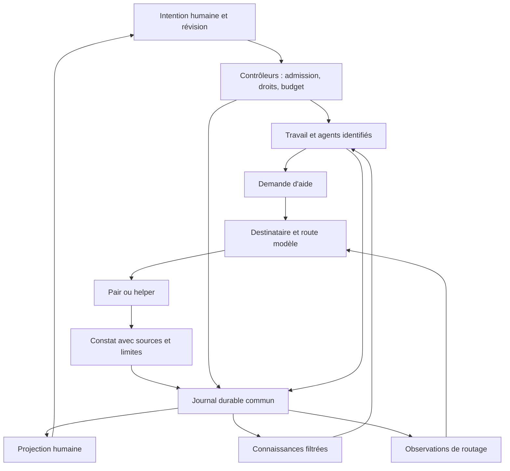

# Entraide, modèles et cœur central : relier logique et vues

Recherche du 3 octobre 2026. Proposition d'architecture, pas fonctionnalité livrée.

Sources locales : [direction produit](MASTER-PRODUCT-DIRECTION.md),
[direction visuelle](MASTER-DESIGN-DIRECTION.source.txt),
[contrat AR01 à AR07](AGENT-ASSIST-ROUTING.md).
L'[annexe logique](AGENT-ASSIST-LOGIC-RESEARCH.md) examine huit sources primaires supplémentaires et leurs limites.

## Conclusion

Cuesheet doit avoir un état durable commun, dont les agents et l'interface reçoivent des vues adaptées. L'entraide est un travail identifié, le modèle est un moyen d'exécution interchangeable, et une découverte est une information sourcée. Aucun de ces objets ne doit dépendre du texte affiché dans le chat.

La recommandation est de relier les journaux et contrôleurs existants. Les sources ne justifient ni réécriture Rust ni ajout immédiat d'un framework. Cette conclusion est une inférence adaptée au code et au produit Cuesheet, pas une recommandation universelle des auteurs cités.

## Ce que les autres apportent réellement

| Source primaire | Fait utile | Décision pour Cuesheet |
|---|---|---|
| [AG-UI Events](https://docs.ag-ui.com/concepts/events), consulté le 03/10/2026 | Distingue événements de cycle, messages, outils, snapshots/deltas d'état et activités structurées. Les activités destinées au client ne constituent pas automatiquement le contexte de l'agent. | Retenir les identités stables et les mises à jour structurées. Construire séparément la projection humaine et le contexte agent depuis le journal. |
| [Claude Code Agent teams](https://code.claude.com/docs/en/agent-teams), consulté le 03/10/2026 | Tâches partagées et messages entre équipiers ; inspection dans le même terminal possible. Fonction expérimentale avec limites de reprise, de statut et d'équipes imbriquées. | Retenir l'inspection à la demande et l'aide directe. Ne pas copier ces limitations pour notre promesse d'entraide universelle. |
| [OpenCode v2 Agents](https://opencode.ai/v2/docs/agents), consulté le 03/10/2026 | Agents principaux et sous-agents, contextes enfants et configuration de modèles ; permissions du lancement et du sous-agent distinctes. | Séparer identité de l'agent, route modèle et capacités. Vérifier la version installée avant de réutiliser un contrat v2. |
| [ACP v1 Tool calls](https://agentclientprotocol.com/protocol/v1/tool-calls), consulté le 03/10/2026 | Les appels d'outils ont une identité et un statut ; leurs contenus peuvent porter des éléments affichables comme diff ou terminal. | Une étape ouvre son artefact réel ou son reçu. Ne pas fabriquer une carte de succès à partir d'une phrase du modèle. |
| [Microsoft, Human-AI interaction](https://www.microsoft.com/en-us/research/articles/how-to-build-effective-human-ai-interaction-considerations-for-machine-learning-and-software-engineering/), 07/02/2020 | Une expérience explicable dépend aussi de signaux disponibles côté système, pas uniquement de présentation. | Produire dès le contrôleur les raisons de routage, états d'attente et possibilités de correction. |
| [Cognition, Multi-Agents: What's Actually Working](https://cognition.com/blog/multi-agents-working), 22/04/2026 | Retour d'expérience favorable à des agents qui apportent de l'intelligence autour d'écritures coordonnées. Le conseil d'un modèle plus fort ne compense pas toujours un modèle principal incapable de bien solliciter cette aide. | Permettre à chacun de demander de l'aide, tout en contrôlant les écritures. Ajouter des déclencheurs système d'assistance ; ne pas dépendre uniquement de l'auto-évaluation du modèle. |

Ces pages décrivent des produits et versions différents. Aucun benchmark comparatif Cuesheet n'a été réalisé. Les résultats commerciaux et mesures internes ne constituent pas des garanties transférables. Les protocoles évolutifs devront être figés à une version si nous ajoutons un adaptateur.

### Les protocoles ne sont pas interchangeables

- A2A décrit les échanges entre agents : tâches, messages, artefacts. Voir l'annexe logique et la [spécification](https://a2a-protocol.org/latest/specification/).
- ACP décrit les échanges entre un client, notamment éditeur, et un agent.
- AG-UI décrit des événements destinés à l'interface.
- Aucun ne fournit à lui seul notre politique de vérité, de permissions, de reprise ou de choix des modèles.

Les prendre comme références de contrats suffit pour cette tranche locale. Ajouter trois couches réseau ne résoudrait pas le parcours actuel.

## Modèle commun proposé



Le journal contient des événements acceptés par des contrôleurs. Il n'est pas un flux de pensées internes. Le cœur combine ce journal, les règles et les projections reconstructibles ; aucun agent central omniscient n'est nécessaire.

### Objets et identités

| Objet | Contrat minimal proposé |
|---|---|
| Intention | Identité, portée, révision, contraintes et critères humains |
| Travail | Identité stable, état, agent responsable, dépendances, révision d'intention |
| Demande d'aide | Demandeur, question, attendu, sources, échéance, budget, parent éventuel |
| Décision de route | Candidats admissibles, route réelle, motif, contraintes, observations utilisées |
| Constat | Auteur, sources et versions, portée, qualification, inconnues, conditions d'invalidation |
| Artefact | Diff ou résultat identifié, cible et empreinte, producteur |
| Preuve | Critère, méthode, cible et empreinte, résultat et limites |
| Livraison de contexte | Constat, destinataire, curseur livré, accusé de consommation |

Chaque événement relie ses objets, sa cause et la révision courante. Un changement de modèle ne crée pas un nouvel agent. Un redémarrage ne crée pas une nouvelle demande d'aide. Une vue ouverte ne lance aucune inférence.

## Relier chaque transition à une interaction

Les noms suivants précisent la proposition ; leur sérialisation doit être alignée avec AR-T01 et la compatibilité du journal existant.

| Transition logique | Changement visible dans le flux | Interaction utile |
|---|---|---|
| Aide demandée, pas encore admise | « Persistance demande un avis sur la reprise » ; état en attente explicite | Voir la question et la cause de l'attente |
| Aide admise | Une branche courte apparaît sous le travail concerné | Ouvrir le helper, sa portée et ses sources |
| Route choisie | Modèle effectif visible en détail ; motif court si changement significatif | Comprendre le choix ou imposer une route admissible |
| Constat publié | « Une écriture peut avoir réussi avant la coupure » ; qualification « à vérifier » | Ouvrir les sources et les travaux concernés |
| Constat livré | Destinataires informés affichés dans le détail | Distinguer livré de pris en compte |
| Constat consommé à une frontière sûre | Le travail destinataire indique le changement de direction | Voir quelle révision a été utilisée |
| Artefact proposé | « Correction proposée : 2 fichiers » avec identité stable | Ouvrir le diff et les preuves disponibles |
| Critère vérifié | Résultat attaché à la cible effectivement testée | Ouvrir la commande, le résultat et ses limites |
| Intention corrigée | Les travaux affectés changent d'état ; résultats obsolètes identifiés | Continuer à écrire sans attendre la fin des agents |
| Reprise ou panne | État reconstruit ; effet incertain explicitement signalé | Inspecter ce qui est confirmé avant toute reprise d'effet |

La fermeture d'un stream, une réponse convaincante ou trois avis concordants ne remplacent aucune preuve. Une nouvelle empreinte de fichier invalide les preuves qui ne couvrent plus la cible.

## Les vues : un flux et quatre inspections temporaires

Le défaut reste une seule surface terminal avec l'intention, les travaux importants, les changements utiles et la saisie. Pas de colonnes permanentes ni de conversation par agent à surveiller.

1. **Travail** : qui agit, qui aide qui, quelle attente, quelles dépendances. Entrée sur un travail ouvre ses détails ; Échap revient au flux et au brouillon.
2. **Choix du modèle** : route effective, motif, alternatives admissibles, contraintes et observations. Le défaut humain reste Flash. Les inconnues de coût ou de qualité restent affichées comme inconnues.
3. **Connaissance** : découverte, source, qualification, fraîcheur, destinataires et consommation. La vue répond à « qu'est-ce que cela change ? ».
4. **Preuve** : diff, reçu d'effet et validation liée à une révision. La vue répond à « qu'est-ce qui a réellement été fait et vérifié ? ».

Ce sont quatre lectures des mêmes objets, accessibles depuis le flux. Les raccourcis définitifs restent à vérifier contre les commandes existantes ; ne pas réserver de touches sans cette vérification.

### Exemple de présentation, sans prétendre au rendu livré

```text
› Rendre la reprise de Cuesheet fiable

  Persistance · examine la reprise
  └─ Relecture · aide sur les effets interrompus

  À vérifier : une écriture peut survivre à la coupure.
  Source : reçu d'exécution #42 · concerne Persistance et Vérification

  Vérification · a pris en compte ce constat
  Correction proposée · ouvrir les changements

› [ta correction reste saisissable ici]
```

L'animation a un sens précis : apparition à l'admission réelle, mise à jour au changement d'état, stabilisation au résultat. Un déplacement vers un autre travail ne signifie pas « pris en compte » sans accusé correspondant. Pas de clignotement global ni de fausses étapes pendant l'attente réseau. Le mode de mouvement réduit conserve toute l'information.

Afficher un résumé d'activité public et les décisions explicables, plutôt que le raisonnement interne brut. Le master visuel impose cette distinction ; la présence actuelle d'un flux de raisonnement fournisseur n'est pas une raison pour en faire le contrat du produit.

## Quel contexte partager et quand appeler de l'aide

La recommandation est une capsule par demande : objectif courant, question, observations, décisions applicables et références récupérables. Un helper peut demander les informations manquantes. Une relecture indépendante peut commencer par le diff et ses critères, puis retrouver les contraintes humaines avant de proposer une action.

Le rapport Cognition décrit à la fois une relecture avec contexte neuf et du conseil avec contexte largement partagé. Il ne justifie donc pas une règle universelle « toujours tout partager » ou « toujours résumer ». Le type de travail et le risque de perdre une décision déterminent la capsule.

Déclencheurs proposés : demande volontaire de n'importe quel agent ; échecs répétés de format ou de stratégie ; absence de progrès ; besoin d'une capacité absente ; contrôle indépendant avant intégration. Un refus de quota appelle une décision de disponibilité, pas un jugement sur l'intelligence du modèle.

« Meilleur modèle » signifie ici meilleur candidat admissible selon la tâche et les observations disponibles. Au démarrage, les préférences explicites priment. L'apprentissage enrichit des observations traçables ; il ne prétend pas entraîner magiquement un routeur. [RouteLLM](https://arxiv.org/abs/2406.18665v4) évalue des routeurs appris avec des données de préférence, ce que Cuesheet n'a pas encore démontré posséder.

## Ancrage dans le dépôt

| Point existant | Évolution proposée |
|---|---|
| `src/adapters/agent-consultation.ts` | Extraire le contrat d'assistance commun au-delà des seuls consultants textuels |
| `src/adapters/code-worker-loop.ts` | Rendre l'aide accessible au worker avec admission centrale et frontières sûres |
| `src/adapters/agent-models.ts` | Conserver les préférences humaines ; distinguer décision runtime et configuration |
| `src/adapters/model-catalog.ts` | Distinguer identité du catalogue et capacités réellement attestées |
| `src/adapters/model-usage.ts` | Relier consommation, route et résultat sans transformer coût inconnu en zéro |
| `src/adapters/shared-context.ts` | Injecter les constats pertinents et frais, avec curseurs et provenance |
| Projections et composants terminal | Consommer les mêmes identités ; inspections, saisie et retour au flux |

Les contrats de migration, annulation et budgets restent nécessaires. Une assistance ne donne aucun droit supplémentaire. Plusieurs agents peuvent conseiller ; les modifications couplées exigent une propriété claire des fichiers ou des espaces isolés et une intégration contrôlée.

## Première tranche qui démontrerait le produit

Suivre le graphe AR-T01 à AR-T07 existant, sans créer une deuxième roadmap. La première démonstration verticale doit faire ceci dans le Cuesheet installé :

1. Un worker rencontre une difficulté et demande une aide précisément visible.
2. Le contrôleur admet un pair ou helper et choisit une route autorisée ; le motif est inspectable.
3. Le helper produit un constat sourcé, enregistré au cœur avec son statut d'inférence.
4. Un autre agent reçoit puis consomme ce constat et adapte son travail.
5. L'humain corrige la demande pendant le travail ; les résultats concernés deviennent périmés, les autres restent utiles.
6. Une proposition ouvre son vrai diff et une validation porte sur la bonne empreinte.
7. Après redémarrage, les mêmes travaux, découvertes et preuves sont présents, sans duplication d'effet.

Vérifier aussi cycle d'entraide, fournisseur indisponible, résultat livré deux fois et découverte privée. Les invariants peuvent être démontrés avec une simulation contrôlée, mais celle-ci doit être distinguée du parcours avec un fournisseur réel. Ni le nombre de tests ni une vidéo fluide ne suffisent à valider ce parcours.

## État de cette recherche

Recherche documentaire terminée ; recommandation et lien vues/logique documentés. Aucun code runtime modifié et aucun critère AR déclaré vérifié. L'implémentation demeure PLANNED. Restent à démontrer : pertinence du routage, consommation réelle entre tous les rôles, reprise et utilisabilité dans le terminal. Les références visuelles originales manquantes et le refus esthétique précédent ne sont pas résolus par ce rapport.

## Complément : recherche web sur le rendu et les interactions

Recherche complémentaire du 3 octobre 2026, après demande explicite du propriétaire. Consultation web des sources ci-dessous et inspection dans le navigateur de la page Cursor 3.0, dont une image de la démonstration intégrée. La documentation OpenCode v2 a aussi été examinée dans le navigateur. Cela ne constitue pas un essai des applications connectées ni une validation de leurs performances.

### Comparaison des présentations

| Référence | Observation vérifiée | Transposition proposée |
|---|---|---|
| [Cursor 3.0](https://cursor.com/changelog/3-0), 02/04/2026 | Dans la démonstration consultée, liste des travaux à gauche, compte rendu au centre et changements à droite. Le produit documente aussi le ciblage d'éléments UI pour donner un retour précis. | Rapprocher une étape de son résultat inspectable. Dans le terminal, ouvrir le détail temporairement ; conserver l'identité du travail sélectionné et le brouillon au retour. |
| [Cursor 2.0](https://cursor.com/changelog/2-0), 29/10/2025 | Le parallélisme documenté s'appuie sur des copies isolées, avec une revue de changements regroupée. | Exposer l'espace de travail dans le détail d'un agent et présenter une proposition cohérente à relire. L'isolation technique doit correspondre à ce que l'interface promet. |
| [OpenCode v2 TUI](https://opencode.ai/v2/docs/cli/tui/), consulté le 03/10/2026 | La saisie peut réorienter la session active. Commandes filtrables, références de fichiers, modèles, agents et retour sur l'historique sont accessibles depuis le terminal. | Une saisie stable, commandes découvrables et références sélectionnables. Afficher explicitement si le message corrige le travail courant ou attend son tour. Les raccourcis ont varié entre résultat indexé et page actuelle : la page consultée prime. |
| [Devin Desktop](https://cognition.com/blog/introducing-devin-desktop), 02/06/2026 | L'annonce regroupe agents locaux/distants, contexte et revue ; les Spaces servent au partage de contexte entre agents liés. | Rendre le périmètre partagé compréhensible : quels agents travaillent ensemble et quelles informations ils peuvent partager. Aucun test de Spaces réalisé ici. |
| [Carbon for AI](https://www.carbondesignsystem.com/building-blocks/foundations/carbon-for-ai), page indiquant une mise à jour au 12/08/2026 | Explication résumée dans le contexte, puis accès volontaire au détail. | Le modèle et la provenance ouvrent une explication courte. Le détail technique reste disponible sans occuper en permanence le flux. |

### Direction de rendu proposée pour Cuesheet

La recommandation suivante est une synthèse propre à Cuesheet. Les références ne démontrent pas qu'elle est optimale ; un parcours réel devra la confirmer.

- **Composition** : un en-tête discret pour la mission et son périmètre ; un flux dont les groupes suivent les travaux ; une saisie toujours disponible. La largeur utile s'adapte au terminal, avec davantage de place au diff lors de l'inspection.
- **Hiérarchie** : intention et résultat au premier niveau, activité au second, commandes brutes au troisième. Un appel d'outil répété actualise son groupe plutôt que de produire plusieurs paragraphes.
- **Agents** : nommer le travail (« Reprise », « Relecture »), puis afficher le modèle en information secondaire. Une branche d'aide apparaît sous le demandeur avec son objectif ; pas de graphe animé permanent.
- **États** : texte court accompagné d'un signe distinct : en cours, attend un avis, attend le fournisseur, à vérifier, vérifié, interrompu. Ne jamais dépendre exclusivement de la couleur.
- **Contrôle** : action d'inspection sur chaque travail ; actions de source et de diff sur les résultats ; arrêt et correction accessibles pendant l'exécution. Toute commande indisponible explique la condition manquante.
- **Explication** : montrer l'action courante, la décision et sa raison publique. Un résumé d'avancement structuré remplace le pavé de narration et le déversement de raisonnement interne.
- **Mouvement** : transitions locales aux changements confirmés. Pas de remise à zéro du flux, de réorganisation automatique pendant une sélection ou de déplacement du curseur de saisie. Une animation d'attente ne prétend pas mesurer une progression inconnue.
- **Lecture pendant le streaming** : ancrer le défilement quand l'utilisateur remonte ; signaler les nouveaux événements et offrir un retour au direct. Regrouper les fragments pour éviter les changements de hauteur à chaque token.
- **Retour après inspection** : restaurer sélection, position de lecture et brouillon. Le détail ne doit pas obliger à retrouver sa place.
- **Résultat** : présenter le changement obtenu, le diff et les validations disponibles ensemble. Une défaillance conserve les résultats partiels et indique la prochaine action possible.

### Exemple de parcours proposé

```text
Cuesheet · Fiabiliser la reprise · espace isolé

Reprise       examine les effets interrompus
  Relecture   apporte un avis sur les reçus d'écriture
              modèle : route sélectionnée · pourquoi ?

Constat à vérifier
Une écriture peut avoir réussi avant la coupure.
[source]  [agents concernés]

Vérification  a pris en compte le constat
Proposition   2 fichiers modifiés · [voir le diff]

› Ajoute aussi le cas où le fournisseur coupe sa réponse
  Corrige le travail en cours · commandes / · arrêter
```

Les crochets représentent des affordances à concevoir pour clavier et, si supportée, souris. Aucun raccourci ni widget ci-dessus n'est annoncé comme déjà implémenté.

### Critères de rendu qui peuvent faire échouer la proposition

1. L'utilisateur identifie l'action en cours, l'attente et la prochaine action possible sans ouvrir les logs.
2. Il corrige pendant une exécution, voit l'accusé de réception et retrouve son brouillon après inspection.
3. Il distingue aide demandée, réponse reçue, connaissance consommée et résultat vérifié.
4. Le streaming ne déplace ni la saisie ni la sélection ; le défilement manuel reste stable.
5. À 80×24, les décisions nécessaires et la saisie restent accessibles ; aux grandes tailles, les détails utilisent réellement la place disponible.
6. Une coupure et une reprise conservent les identités et résultats, sans animation laissant croire à un nouveau travail.

Ces critères restent à vérifier sur l'application. Cette recherche complète la direction précédente ; elle ne clôt ni AR-T06 ni l'acceptation esthétique.
